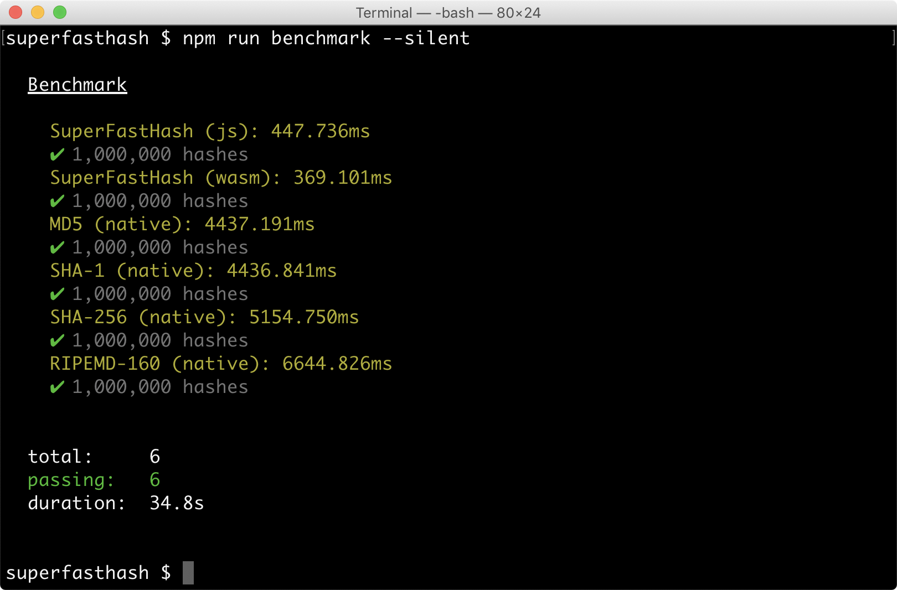

This is an [npm](https://npmjs.com) module that implements the
[SuperFastHash algorithm by Paul Hsieh](http://www.azillionmonkeys.com/qed/hash.html)
in JavaScript (ECMAScript 2015) and WebAssembly.

The WebAssembly implementation is based on
[AssemblyScript](https://github.com/AssemblyScript/assemblyscript).

## Installation

You can add the module to your project using the following command:

```
npm install mjethani/superfasthash --save
```

## Usage

Here's a simple example:

```javascript
let { hash } = require('superfasthash');

// The hash function expects a byte array.
let hashText = text => hash(new Uint8ClampedArray([...Buffer.from(text)]));

console.log(hashText('Hello, world!')); // Prints "1609733543"
```

The above example uses the default JavaScript implementation. If you want to
use the WebAssembly version, you can do it like so:

```javascript
let superfasthash = require('superfasthash/wasm');

let { hash } = superfasthash;
let hashText = text => hash(new Uint8ClampedArray([...Buffer.from(text)]));

superfasthash.initialize().then(() => {
  let digest = hashText('The quick brown fox jumps over the lazy dog.');
  console.log(digest); // Prints "-1533272743"
});
```

## Development

To get started, you can run the following sequence of commands:

```
git clone https://github.com/mjethani/superfasthash.git
cd superfasthash
npm install
npm test
```

The source files are in the `src` directory. If you make a change to the
WebAssembly implementation, you will have to run `npm run build` to rebuild the
distribution in the `dist` directory. You might want to run the unit tests in
the `tests` directory by running `npm test`.

## Performance

The file `benchmarks/benchmark.js` contains a little performance benchmark. You
can try it out by running `npm run benchmark`.



## License

Please see the `LICENSE` file.

---

Copyright 2019 Manish Jethani
